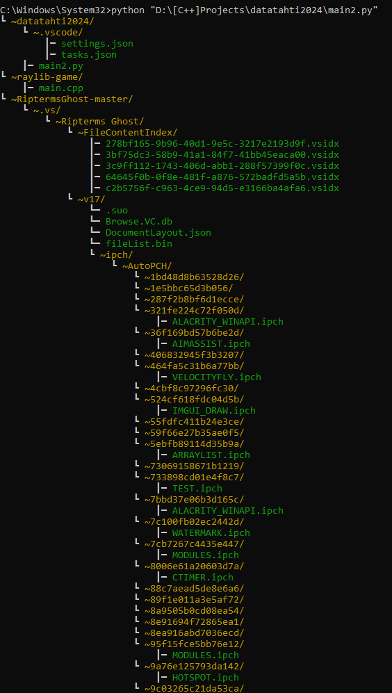

**BDS...**
 - just making the project tree

### where it could be used? (imo)
I thought that it could be using for making a project tree, so for example you can copy it, and insert into gpt prompt, so it would understand where are different fiels located.

### preview!

### how to use?

1. download the file scanner.py and requirements.txt
2. place them in 1 folder
3. open the cmd, and go into your fodler.
4. type command `pip install -r reqierements.txt`
5. run it ( also if you want to scan projects which are located in the system folders, you should run this file in console with admin mode)
6. when you run it, you will asked for the directory. (you have to write your path with double slashes, like D:\\[C++}Projects\\...
7. you will get the result
